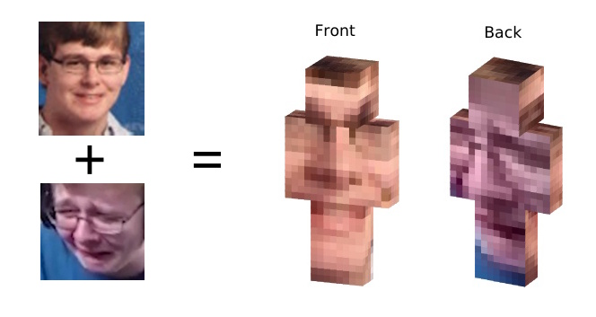

# epicminecraftskinz

generate truly epic™ minecraft (java edition) skins!



## Usage

To generate a skin you need two images, one for the front of the skin and one for the back,
which you pass to the program as arguments.

The third argument is the desired output file.
This file cannot exist and will not be overwritten, and is always saved as a PNG image.

```sh
epicminecraftskinz front.jpg back.jpg output.png
```

It is recommended to use square, close-up images for the inputs.

---
You don't know what a command line is?
You don't get all of this **nerd shit**?
Check [this](http://www.google.com/search?q=what+is+a+command+line+and+how+do+I+use+it) out!

## Building

To build the program simply run
```sh
cargo build
```

To generate release builds you may pass the `--release` argument, or use the
`build_releases.sh` script to automatically generate zip files for both
Microsoft Windows and Linux systems.
